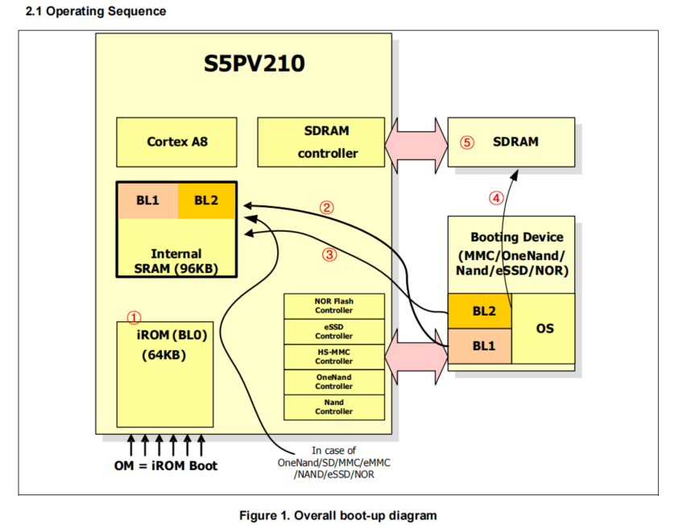
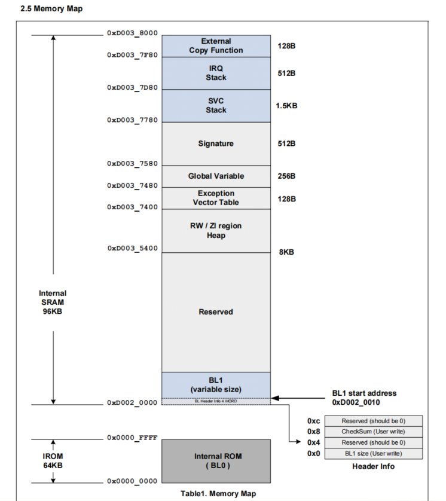

# ==uboot——V210的启动机制原理==

### 头文件解析

这些头文件都存储在固定的目录下（这两个目录也在Makefile的配置文件里面定义了的）

+ u-boot-2012.10\include
+ u-boot-2012.10\arch\arm\include\asm

```c
#include <asm-offsets.h>
#include <config.h>
#include <version.h>
#include <asm/system.h>
#include <linux/linkage.h>
```

```asm
.globl _start
_start: b	reset
	#未定义指令异常
	ldr	pc, _undefined_instruction
	#软中断异常
	ldr	pc, _software_interrupt
	#预取址终止，cpu取不到下一条指令了
	ldr	pc, _prefetch_abort
	#到一个不存在的地址取数据
	ldr	pc, _data_abort
	ldr	pc, _not_used
	#一般的中断
	ldr	pc, _irq
	#块中断
	ldr	pc, _fiq
#上面的ldr,pc的意思是，把后面的标号的内容放到pc指针中
```

+ _start: b	reset

  + 跳转到下面的reset

    ```asm
    reset:
    	bl	save_boot_params
    	/*
    	 * set the cpu to SVC32 mode
    	 */
    	mrs	r0, cpsr
    	bic	r0, r0, #0x1f
    	orr	r0, r0, #0xd3
    	msr	cpsr,r0
    ```

+ 下面的七条指令是定义异常的

+ 可以看到这些异常的标号的内容是与一个宏相关的==CONFIG_SPL_BUILD==

  ```asm
  #ifdef CONFIG_SPL_BUILD
  _undefined_instruction: .word _undefined_instruction
  _software_interrupt:	.word _software_interrupt
  _prefetch_abort:	.word _prefetch_abort
  _data_abort:		.word _data_abort
  _not_used:		.word _not_used
  _irq:			.word _irq
  _fiq:			.word _fiq
  _pad:			.word 0x12345678 /* now 16*4=64 */
  #else
  _undefined_instruction: .word undefined_instruction
  _software_interrupt:	.word software_interrupt
  _prefetch_abort:	.word prefetch_abort
  _data_abort:		.word data_abort
  _not_used:		.word not_used
  _irq:			.word irq
  _fiq:			.word fiq
  _pad:			.word 0x12345678 /* now 16*4=64 */
  ```

  #### ==[在第七页（启动流程）](./S5PV210_iROM_ApplicationNote_Preliminary_20091126.pdf)==

+ 流程图
  + 图中的箭头代表了这些数据传输的方向
+ 下面这两款芯片的启动方式的区别就体现了这两种启动方式的不同之处。
+ 6410的启动过程
  + 会先启动iROM，这个过程会初始化一些例如看门狗和外设时钟等外设器件。
  + 第二，会将sd卡或者flash中头4K的内容——BL1加载到片内RAM中运行，4K很小几乎干不了什么事情。这4K配置了DDR的主存（SDRAM）.
  + 再把bootloader中的大部分——BL2加载到SDRAM中。
  + 然后再把程序的入口跳转到BL2，即运行bootloader
  + 再将OS镜像加载到主存——SDRAM中 
  + 最后跳转到OS的入口中，开始运行OS
  + 以上是6410的设置，针对芯片的设置，uboot就进行如下的操作
    + 头4K需要加载到iROM中的内容，还有大部分的内容（200K）,需要加载到DDR的内容一起组成了一个uboot.bin文件，这个文件会被烧到SD卡或者flash中。
    + 系统上电以后，系统会将iROM的内容加载到SRAM中，然后这个程序会判断自己是在哪个地方（SRAM或者SDRAM中），如果是在SRAM中就会配置SDRAM（==注意，SDRAM每次上电都需要重新配置==），之后将整个bootloader加载到SDRAN里面，再跳转到uboot（即上面说的uboot.bin文件）的入口中运行。
    + 再uboot的入口处，也会进行判断，判断自己在哪里（SDRAM或者SRAM中），如果在SDRAM中，直接 跳过前面的4K内容，开始运行bootloader的大部分内容——驱动程序，shell命令行等等。
    + 当要加载OS的时候，将OS镜像加载到主存（SDRAM）当中,加载完成之后，将程序跳转到主存OS当中，整个bootloader启动过程就完成了。
  + ![[image-20251017191011499.png]]

+ 210的启动过程（只讲述与6410的不同）
  + 可以看出片内iROM的大小变大了从32增加到了64，这样就可以将一些读取固件的函数加到这里。
  + 第二，片内SRAM的也增加了，变为了96K.
    + 这样做有好处，就是可以将所有的bootloader程序全部加载到这里运行，这样就不用像6410那样，将bootloader一分为二。但是uboot却无法这样做，因为uboot编译完之后一般有接近200k的大小，96K根本就装不下这么大的程序。
  + 所以，uboot面对这种情况，就直接将uboot做成了两个镜像
    + ==uboot_spl.bin==,这个名称就与上面提到的那个宏对应上了==CONFIG_SPL_BUILD==,sencond program loader，大小为16K
    + ==uboot.bin==,大小约为200K
  + 启动流程
    + 上电之后，先将uboot_spl.bin加载到BL1中运行，然后绕开BL2，直接配置SDRAM，再将uboot.bin加载到SDRAM中，再直接跳转到uboot.bin中运行



1. CONFIG_SPL_BUILD表示Sram存储较小的uboot源码，所以能做的事情很少（因为空间不够），所以它对应跳转的指令都是跳到自己那里（即死循环）。
2. 而如果不带CONFIG_SPL_BUILD的话，就会多一些异常处理指令。

+ 对于uboot文件中的解释

  ```asm
  #ifdef CONFIG_SPL_BUILD
  _undefined_instruction: .word _undefined_instruction
  _software_interrupt:	.word _software_interrupt
  _prefetch_abort:	.word _prefetch_abort
  _data_abort:		.word _data_abort
  _not_used:		.word _not_used
  _irq:			.word _irq
  _fiq:			.word _fiq
  _pad:			.word 0x12345678 /* now 16*4=64 */
  #else
  _undefined_instruction: .word undefined_instruction
  _software_interrupt:	.word software_interrupt
  _prefetch_abort:	.word prefetch_abort
  _data_abort:		.word data_abort
  _not_used:		.word not_used
  _irq:			.word irq
  _fiq:			.word fiq
  _pad:			.word 0x12345678 /* now 16*4=64 */
  #endif	/* CONFIG_SPL_BUILD */
  ```

  + 可以看出，当启动spl的时候，因为spl文件很小，只有16k，做不了很复杂的事，所以它的异常向量什么事情也没干，就是自己跳转到自己，也就是死循环。 

  + 但是如果没有启用spl的时候，==异常向量跳转的函数就有实际的执行内容了==

    + ```asm
      undefined_instruction:
      	get_bad_stack
      	bad_save_user_regs
      	bl	do_undefined_instruction
      ```

#### 异常向量表的地址映射问题

一般情况下，发生异常后，会跳转到0x0000 0000或者0xffff 0000,上面的跳转地址是通过cp15协处理器配置。但是这引出了一个问题，==如何保证 `	ldr	pc, _undefined_instruction`指令就刚刚好在0x0000 0004地址处？==

我们编写的程序是先放在BL1的，在图中也就是0xD002 0010处，显然和应该对应的0x0000 0004对应不上，也就是说，当发生异常之后，CPU会跳转到0x0000 0004运行，但是，我们写的程序没有放在那里，也就不会被运行。这就牵扯出了==异常向量和地址映射的问题==

==地址映射表==




+ 所以它在设计的时候（指这款三星芯片），将异常向量重新换了一个位置，也就是上图中0x0003_7400开头的位置
+ 也就是说，当异常发生的时候，程序不会跳到一般情况下的0x0000 0004处运行，它会跳到0x0003_7404运行。
+ 所以如果我们希望运行bootloader的时候也能够正常处理中断和异常的话，我们就要提前将那些异常向量映射到0x0000 7400处去
+ 一般当片内（指SRAM）使用完成之后，就不会再使用这些地址了。这产生一个问题，当运行到SDRAM——即这里面的uboot的时候发生了异常的话，应该跳转到哪里找中断向量表呢？
  + arm提供了一个方案，可以通过设置cp15协处理器来实现，在这里面有一个==VBAR寄存器==，可以将程序开头的地址拷贝到这个寄存器里面，这个时候再发生异常的话，就会跳转到这个寄存器指定的地址去运行中断或者异常。

