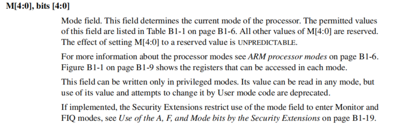
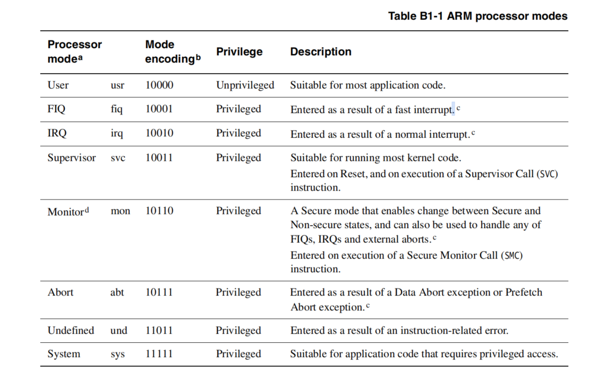
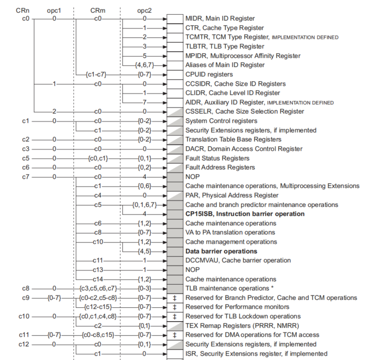
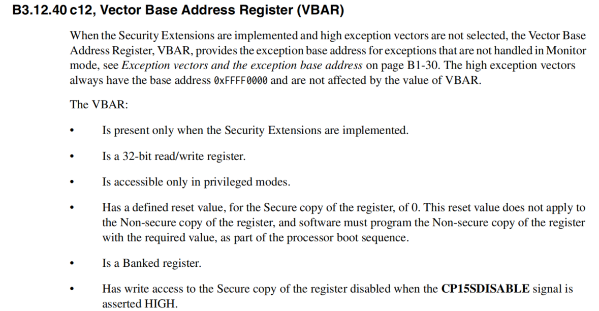
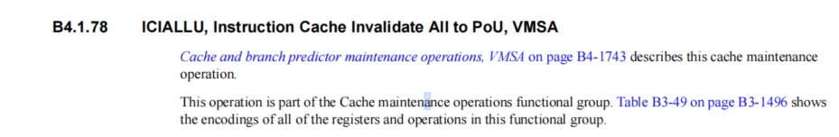
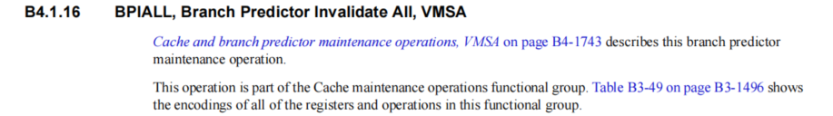

## 编译uboot


```shell
#安装交叉编译工具链
sudo apt-get install gcc-arm-linux-gnueabi
#清除项目，删除所有生成的配置文件
make distclean
#为s5p_goni开发板生成对应的的U-Boot配置
make s5p_goni_config
#使用指定的交叉编译工具链编译U-Boot
make CROSS_COMPILE=arm-linux-gnueabi-
```

==编译出来的产物==（除开u-boot.16K）

```shell
user@my-computer:~/u-boot-2012.10$ ll u*
-rwxrwxr-x 1 user user 903586 10月 18 15:14 u-boot*
-rw-rw-r-- 1 user user  16384 10月 18 14:54 u-boot.16k
-rw-rw-r-- 1 user user 187676 10月 18 15:14 u-boot.bin
-rw-rw-r-- 1 user user    923 10月 18 15:14 u-boot.lds
-rw-rw-r-- 1 user user  81074 10月 18 15:14 u-boot.map
-rw-rw-r-- 1 user user 563092 10月 18 15:14 u-boot.srec

```

##### 文件介绍

1. u-boot
   1. 这里面包含了代码信息，标号信息，地址信息，这个文件不能直接拷贝到板子上运行，将这个文件使用strip命令剥离这些信息之后的文件才可以放到开发板上运行，也就是u-boot.bin文件
   2. 这个文件用于分析uboot
2. u-boot.bin
   1. 没有任何调试信息
   2. 这个文件用于烧录到板子上面运行

##### 调试u-boot

```shell
#输出反汇编代码并且使用less进行查看
arm-linux-objdump -S u-boot | less
```

##### 异常向量段定义结束

```asm
#表示异常向量段结束
.global _end_vect
#在段的结尾进行操作
_end_vect:
#进行十六字节对齐，如果本身没有对齐，就会填充后面这个魔数，因为这个数占了4字节，而arm指令都是四字节存储的，所以只要填充这个数，就一定能够达到16字节对齐
	.balignl 16,0xdeadbeef
```

##### uboot到ddr的起始地址定义

```asm
.globl _TEXT_BASE
_TEXT_BASE:
	.word	CONFIG_SYS_TEXT_BASE
#CONFIG_SYS_TEXT_BASE,这个宏是在之前的配置文件里面定义的，s5p_goni_config指令，他表示uboot烧录到ddr内存里面的起始地址
```

##### 对于无效指向的定义

```asm
#ifdef CONFIG_USE_IRQ
/* IRQ stack memory (calculated at run-time) */
.globl IRQ_STACK_START
IRQ_STACK_START:
	.word	0x0badc0de

/* IRQ stack memory (calculated at run-time) */
.globl FIQ_STACK_START
FIQ_STACK_START:
	.word 0x0badc0de
#endif
```

从上面的代码中，可以看得出来IRQ_STACK_START符号定义了中断栈的起始位置，而且他定义的位置是一个无效的位置——0badc0de.

为什么这样做？因为我们都还有初始化栈，所以现在根本就不知道栈的位置到底在哪儿，也就无法确定这个值，于是就只能定义为一个无效的数据。在后面代码运行的时候，会修改这个值（==calculated at run-time==）。

arm中，中断的栈和普通程序的栈是隔离的。

##### b和bl的区别

b:	它意思就是往标号进行跳转，但是不能够跳转回来。

bl:	意思就是进行跳转，但是能够跳转回来。先执行b，然后把下一条要执行的语句的地址放到==lr==寄存器，等子过程运行完之后执行语句`mov	pc,lr`就跳转回原来的地方，继续往下运行。

##### 带模式的跳转

```asm
ENTRY(save_boot_params)
	bx	lr			@ back to my caller
```

bx：	先跳转，并返回原有的模式。

##### EBRTY(save_boot_params)

在汇编文件里面找不到这个宏本身在哪里，其实在上面定义的头文件里面。

[这两个宏的展开](save_boot_params相关宏展开.txt)

```asm
ENTRY(save_boot_params)
	bx	lr			@ back to my caller
ENDPROC(save_boot_params)
	.weak	save_boot_params
```

##### 这些汇编指令的定义

这里用到的汇编指令都是gcc里面的

例如： [Type - Using as](https://sourceware.org/binutils/docs-2.19/as/Type.html)能够查到type指令的定义。

#### reset

```asm
/*
 * the actual reset code
 */

reset:
	bl	save_boot_params
	/*
	 * set the cpu to SVC32 mode
	 */
	mrs	r0, cpsr
	bic	r0, r0, #0x1f
	orr	r0, r0, #0xd3
	msr	cpsr,r0
```

关于`bl	save_boot_params`的解析都在上面。

下面开始解析其他指令的含义：

##### mrs r0, cpsr以及下面的其他指令

cpsr是arm的一个特殊寄存器，关于这个寄存器的介绍需要到arm的手册里面去查找，因为它是由arm公司设计内核的时候设计的。

==手册==：[ARMv7-AR Architecture Reference Manual](C:\Users\Ran\Desktop\linuc——学习笔记\uboot\ARMv7-AR Architecture Reference Manual.pdf)

关于cpsr寄存器：==手册1166页==




可以看出模式位在最低五位。



`mrs r0, cpsr`：把cpsr寄存器的值放到r0中

`bic r0, r0, #0x1f`: 将指定的位清0

`orr	r0, r0, #0xd3`：设置已经清0过的位，这里的d顺便设置了bit6和bit7，禁止了块中断和中断

`msr	cpsr,r0`：将寄存器的值写回到cpsr寄存器中

### 关于cp15协处理器

cp15不单单是一个寄存器，它是一个协处理器，具有非常多的功能，所以针对他有它特殊的语法来控制。

```asm
/*
 * Setup vector:
 * (OMAP4 spl TEXT_BASE is not 32 byte aligned.
 * Continue to use ROM code vector only in OMAP4 spl)
 */
#if !(defined(CONFIG_OMAP44XX) && defined(CONFIG_SPL_BUILD))
	/* Set V=0 in CP15 SCTRL register - for VBAR to point to vector */
	mrc	p15, 0, r0, c1, c0, 0	@ Read CP15 SCTRL Register
	bic	r0, #CR_V		@ V = 0
	mcr	p15, 0, r0, c1, c0, 0	@ Write CP15 SCTRL Register

	/* Set vector address in CP15 VBAR register */
	ldr	r0, =_start
	mcr	p15, 0, r0, c12, c0, 0	@Set VBAR
#endif
```

==语法解析==

```asm
mrc p15, opc_1, CRn, CRm, opc_2 
#mrc代表从cp15读一个寄存器到通用寄存器去


#CR_V是一个宏，是——(1<<13)

#将r0的值写回指定的cp15寄存器
mcr	p15, 0, r0, c1, c0, 0

#_start是异常向量表开始处的地址（是实际在ddr中运行时的地址）
ldr	r0, =_start

#向量表的位置存在了r0中，然后又把这个值放到了cp15寄存器中（VBAR），当发生异常的时候，就会跳转到VBAR存放的地址处去，这就完成了地址向量的映射过程
mcr	p15, 0, r0, c12, c0, 0
```

总之，以上的操作就是将cp15中的一个寄存器位清0了，效果就是决定了，初始向量的基地址是从0x0000 0000还是0xffff 0000开始：

设置下面这个寄存器的意思就是说，入股我们设置了向量表的位置在0x0000 0000的话，那么我们可以设置向量表在任意位置



##### CONFIG_SKIP_LOWLEVEL_INIT

这个宏是因为bootloader的新旧版本导致的，在新版本中，bootloader在ddr运行的时候，已经运行了下面的两个初始化函数，所以就不需要再运行

在旧版本中，也就是在片内rom中的那段bootloader代码就会运行这两个初始化函数。

```asm
	/* the mask ROM code should have PLL and others stable */
#ifndef CONFIG_SKIP_LOWLEVEL_INIT
	bl	cpu_init_cp15
	bl	cpu_init_crit
#endif
```

cpu_init_cp15函数与cache有关，早期的arm采用冯诺依曼结构，并且在cpu和ram之间加入了缓存。

后面arm更改了设计，在cpu内部加入哈佛结构（即地址总线和数据总线分开），即引入了==i-cache==和==d-cache==。

==为什么要关闭i-cache(invalidate icache)?==

在bootloader启动阶段，ram里面没有严格区分数据段和代码段，我们写的代码可能会去修改代码段的内容，而i-cache对于数据的缓存，可能会导致缓存中的代码数据和ram中的数据不一致，为了防止这种情况的发生，所以直接关闭了i-cache。而且i-cache依赖于==mmu==，但是此时都还没有开启mmu，在mmu开启之前，所有的代码使用的都是物理地址，如果当mmu开启之后，i-cache里面的一些代码还是使用物理地址的话，就会造成错误（因为此时内存由mmu管理，已经是使用虚拟地址了）。

```asm
/*************************************************************************
 *
 * cpu_init_cp15
 *
 * Setup CP15 registers (cache, MMU, TLBs). The I-cache is turned on unless
 * CONFIG_SYS_ICACHE_OFF is defined.
 *
 *************************************************************************/
ENTRY(cpu_init_cp15)
	/*
	 * Invalidate L1 I/D
	 */
	mov	r0, #0			@ set up for MCR
	mcr	p15, 0, r0, c8, c7, 0	@ invalidate TLBs
	mcr	p15, 0, r0, c7, c5, 0	@ invalidate icache
	mcr	p15, 0, r0, c7, c5, 6	@ invalidate BP array
	mcr     p15, 0, r0, c7, c10, 4	@ DSB
	mcr     p15, 0, r0, c7, c5, 4	@ ISB

	/*
	 * disable MMU stuff and caches
	 */
	mrc	p15, 0, r0, c1, c0, 0
	bic	r0, r0, #0x00002000	@ clear bits 13 (--V-)
	bic	r0, r0, #0x00000007	@ clear bits 2:0 (-CAM)
	orr	r0, r0, #0x00000002	@ set bit 1 (--A-) Align
	orr	r0, r0, #0x00000800	@ set bit 11 (Z---) BTB
#ifdef CONFIG_SYS_ICACHE_OFF
	bic	r0, r0, #0x00001000	@ clear bit 12 (I) I-cache
#else
	orr	r0, r0, #0x00001000	@ set bit 12 (I) I-cache
#endif
	mcr	p15, 0, r0, c1, c0, 0
	mov	pc, lr			@ back to my caller
ENDPROC(cpu_init_cp15)

```

[2012版armv7手册](C:\Users\Ran\Desktop\linuc——学习笔记\uboot\DDI0406C_C_arm_architecture_reference_manual.pdf)

==关于cp15寄存器的相关操作在1481页==

`c7 c5 0`

其中的POU可以简单理解为单核的处理器，对于这个寄存器的操作——它是只写的，无论写的是什么内容，都会让i-cache失效。

1. invalidate
   1. 在i-cache里面，对于一条指令，有一个位代表了这个缓存是否有效，所以我们只要把这个为设为无效就可以了
2. flush
   1. 清空操作，会强制将i-cache里面的内容强制清0
3. enable与disenable
   1. 就是使能用或者不用

显然，invalidate比flush更快，因为它清除的内容更少





`c7 c5 6`分支预测无效

cpu是采用流水线操作，并且pc指针是超前于当前运行指令的，所以代码在逻辑上连续执行的时候，cpu也是连续执行的话，就能够提高效率，于是，当遇到分支结构的时候，就会进行预测操作，预测更有可能被执行的代码，好让cpu连续执行我们的代码。

==ignore==和上面那个是一样的，不论写什么都会导致无效




`mcr     p15, 0, r0, c7, c10, 4	@ DSB` 

==上面的这些操作主要就是为了数据的准确性==

###### c1 c0 0

arm处理器一般有七个模式

PL0	usr

PL1	sys,irq,fiq等等

PL2	hyper

##### cpu_init_crit

```asm
/*************************************************************************
 *
 * CPU_init_critical registers
 *
 * setup important registers
 * setup memory timing
 *
 *************************************************************************/
ENTRY(cpu_init_crit)
	/*
	 * Jump to board specific initialization...
	 * The Mask ROM will have already initialized
	 * basic memory. Go here to bump up clock rate and handle
	 * wake up conditions.
	 */
	b	lowlevel_init		@ go setup pll,mux,memory
ENDPROC(cpu_init_crit)
```

