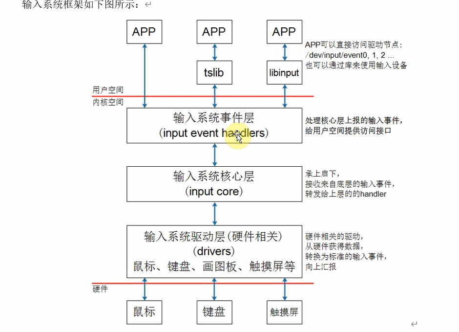

## ==框架概览==

### 驱动程序上报的数据格式

1. type:哪一类事件？

2. code：哪一个事件？

3. value：数据的值。

这三个值就抽象出了绝大多数的输入设备输入的值，不同输入设备上报的数据需要根据情况理解他们上报的值的含义。

==当然，还是会上报更多的信息的。（但是上面三种是比较常用的）==

**有的信息并不是能够马上就上报的**，所以就引申出了一种事件——同步事件。这种同步事件就分隔开了一个一个的完整数据（以同步事件为分界线）。

1. 这种同步事件上报的数据中，type，code，value全部都是0。

### 如何查看输入设备节点对应的都是什么信息？

==`cat /proc/bus/input/devices `==这条命令可以查看。